# Yzl.Extensions.Http.OpenFeign 架构与执行流程

本文档梳理 `Yzl.Extensions.Http.OpenFeign` 的整体架构、模块职责、扩展点，以及一次 Feign 调用从注册到响应返回的完整执行链路。

## 1. 项目定位

`Yzl.Extensions.Http.OpenFeign` 是一个 Spring OpenFeign 风格的 .NET HTTP 客户端框架，核心能力包括：

- 使用 Attribute 声明 HTTP 客户端接口。
- 自动扫描并注册 Feign Client。
- 使用 Castle DynamicProxy 生成接口代理。
- 拦截接口方法调用并构建 `HttpRequestMessage`。
- 通过参数策略处理 Path、Query、Header、Body。
- 通过执行器分发普通 HTTP 请求和 SSE 请求。
- 通过响应解析器解析业务响应结构。
- 通过序列化器完成对象反序列化。
- 集成 `Microsoft.Extensions.Http.Resilience` 提供超时、重试、熔断、对冲。
- 通过 Warmup 降低首次调用延迟。

## 2. 总体架构图

```mermaid
flowchart TB
    subgraph UserApp["使用方应用"]
        ServiceCollection["IServiceCollection<br/>调用 AddFeignStarter"]
        FeignInterface["Feign Client Interface<br/>[FeignClient]<br/>[Get]/[Post]/[RequestParam]/[RequestBody]/[Sse]"]
        Caller["业务代码<br/>注入并调用 Feign 接口"]
    end

    subgraph OpenFeign["Yzl.Extensions.Http.OpenFeign"]
        subgraph Registration["注册与扫描"]
            Extensions["FeignClientExtensions<br/>注册入口"]
            Scanner["App / AssemblyScanner<br/>扫描程序集"]
            Descriptor["FeignClientDescriptor<br/>Feign Client 描述信息"]
            Factory["FeignClientFactory<br/>注册 HttpClient 与代理"]
            Warmup["FeignClientWarmupHostedService<br/>启动预热"]
            WarmupCache["FeignClientWarmupCache<br/>预热 HttpClient 缓存"]
        end

        subgraph ProxyLayer["代理与拦截"]
            Proxy["Castle DynamicProxy<br/>接口代理对象"]
            Interceptor["FeignClientInterceptor<br/>拦截方法调用"]
        end

        subgraph RequestBuild["请求构建"]
            RequestContext["FeignRequestContext<br/>一次请求上下文"]
            ParameterContext["ParameterContext<br/>参数处理上下文"]
            ParamProcessor["ParameterProcessor<br/>执行参数处理"]
            Metadata["MethodParameterMetadata<br/>参数执行计划缓存"]
            PayloadResolvers["ParameterPayloadResolverRegistry<br/>参数 Resolver"]
            Strategies["ParameterStrategyRegistry<br/>参数 Strategy"]
            Headers["FeignRequestHeaderProviderRegistry<br/>全局 Header Provider"]
        end

        subgraph Execution["执行器调度"]
            Dispatcher["RequestExecutorDispatcher<br/>按 Order 选择执行器"]
            HttpExecutor["HttpExecutor<br/>普通 HTTP 请求"]
            SseExecutor["SseExecutor<br/>SSE 请求"]
        end

        subgraph Response["响应处理"]
            ResponseAttribute["FeignResponseAttribute<br/>方法/接口级解析器声明"]
            IResponseResolver["IFeignResponseResolver<br/>响应解析器接口"]
            ResponseResolverProvider["FeignResponseResolverProvider<br/>选择响应解析器"]
            CustomResolver["自定义 ResponseResolver<br/>业务响应格式扩展"]
            GlobalResolver["Global ResponseResolver<br/>IsGlobal + Order"]
            DefaultResolver["DefaultFeignResponseResolver<br/>默认 code/data 响应解析"]
            SerializerProvider["FeignSerializerProvider<br/>选择序列化器"]
            SystemTextJson["SystemTextJsonFeignSerializer"]
            Newtonsoft["NewtonsoftFeignSerializer"]
        end

        subgraph SseFlow["SSE 流处理"]
            SseEngine["SseClientEngine<br/>SSE 连接与重连"]
            SseDecoder["SseDecoder<br/>解析 event-stream"]
            SseStream["FeignSseStream<br/>订阅式消费"]
        end
    end

    subgraph DotNet[".NET 基础设施"]
        DI["Microsoft.Extensions.DependencyInjection"]
        HttpClientFactory["IHttpClientFactory"]
        Resilience["Microsoft.Extensions.Http.Resilience<br/>Timeout / Retry / CircuitBreaker / Hedging"]
        HttpClient["HttpClient"]
        SocketsHandler["SocketsHttpHandler<br/>连接池 / KeepAlive"]
    end

    subgraph Remote["远程服务"]
        HttpApi["HTTP API"]
        SseApi["SSE Endpoint"]
    end

    ServiceCollection --> Extensions
    Extensions --> Scanner
    Scanner --> Descriptor
    Descriptor --> Factory
    Extensions --> Warmup

    Factory --> DI
    Factory --> HttpClientFactory
    Factory --> Resilience
    Factory --> SocketsHandler
    Factory --> Proxy

    Warmup --> HttpClientFactory
    Warmup --> WarmupCache
    Warmup --> Proxy

    Caller --> FeignInterface
    FeignInterface --> Proxy
    Proxy --> Interceptor

    Interceptor --> RequestContext
    Interceptor --> ParameterContext
    Interceptor --> ParamProcessor
    ParamProcessor --> Metadata
    Metadata --> PayloadResolvers
    ParamProcessor --> Strategies
    Interceptor --> Headers
    Interceptor --> Dispatcher

    Dispatcher --> HttpExecutor
    Dispatcher --> SseExecutor

    HttpExecutor --> HttpClient
    HttpExecutor --> ResponseResolverProvider
    FeignInterface --> ResponseAttribute
    ResponseAttribute --> ResponseResolverProvider
    ResponseResolverProvider --> IResponseResolver
    IResponseResolver --> CustomResolver
    IResponseResolver --> GlobalResolver
    IResponseResolver --> DefaultResolver
    ResponseResolverProvider --> CustomResolver
    ResponseResolverProvider --> GlobalResolver
    ResponseResolverProvider --> DefaultResolver
    HttpExecutor --> SerializerProvider
    SerializerProvider --> SystemTextJson
    SerializerProvider --> Newtonsoft

    SseExecutor --> SseEngine
    SseExecutor --> SseStream
    SseEngine --> SseDecoder
    SseEngine --> HttpClient

    HttpClientFactory --> HttpClient
    Resilience --> HttpClient
    SocketsHandler --> HttpClient

    HttpClient --> HttpApi
    HttpClient --> SseApi
```

