# Yzl.Extensions.Http.OpenFeign 架构与执行流程

本文档梳理 `Yzl.Extensions.Http.OpenFeign` 的整体架构、模块职责、扩展点，以及一次 Feign 调用从注册到响应返回的完整执行链路。

## 1. 项目定位

`Yzl.Extensions.Http.OpenFeign` 是一个 Spring OpenFeign 风格的 .NET HTTP 客户端框架，核心能力包括：

- 使用 Attribute 声明 HTTP 客户端接口。
- 自动扫描并注册 Feign Client。
- 使用 Castle DynamicProxy 生成接口代理。
- 拦截接口方法调用并构建 `HttpRequestMessage`。
- 通过参数策略处理 Path、Query、Header、Body。
- 通过执行器分发普通 HTTP 请求和 SSE 请求。
- 通过响应解析器解析业务响应结构。
- 通过序列化器完成对象反序列化。
- 支持 Feign 接口直接返回 `Stream` 或 `byte[]` 下载二进制文件。
- 集成 `Microsoft.Extensions.Http.Resilience` 提供超时、重试、熔断、对冲。
- 通过 Warmup 降低首次调用延迟。

## 2. 总体架构图


```mermaid
flowchart LR
    %% ===== 样式 =====
    classDef app fill:#f6f8fa,stroke:#57606a,stroke-width:1px,color:#24292f;
    classDef core fill:#ddf4ff,stroke:#0969da,stroke-width:1.5px,color:#24292f;
    classDef detail fill:#ffffff,stroke:#8c959f,stroke-width:1px,color:#24292f;
    classDef executor fill:#dafbe1,stroke:#1a7f37,stroke-width:1.5px,color:#24292f;
    classDef response fill:#fff8c5,stroke:#9a6700,stroke-width:1.5px,color:#24292f;
    classDef infra fill:#fbefff,stroke:#8250df,stroke-width:1.2px,color:#24292f;
    classDef remote fill:#ffebe9,stroke:#cf222e,stroke-width:1.2px,color:#24292f;

    %% ===== 使用方 =====
    subgraph UserApp["使用方应用"]
        direction TB
        ServiceCollection["IServiceCollection<br/>AddFeignStarter"]
        FeignInterface["Feign Client Interface<br/>[FeignClient] / [Get] / [Post] / [Sse]"]
        Caller["业务代码<br/>注入并调用接口"]
        ServiceCollection -.注册.-> FeignInterface
        Caller -.调用.-> FeignInterface
    end

    %% ===== OpenFeign 主链路 =====
    subgraph OpenFeign["Yzl.Extensions.Http.OpenFeign"]
        direction LR

        subgraph Registration["① 注册与扫描"]
            direction TB
            Extensions["FeignClientExtensions<br/>注册入口"]
            Scanner["App / AssemblyScanner<br/>扫描程序集"]
            Descriptor["FeignClientDescriptor<br/>Client 描述信息"]
            Factory["FeignClientFactory<br/>注册 HttpClient 与代理"]
            Warmup["FeignClientWarmupHostedService<br/>启动预热"]
            WarmupCache["FeignClientWarmupCache<br/>HttpClient 缓存"]
            Extensions --> Scanner --> Descriptor --> Factory
            Extensions --> Warmup --> WarmupCache
        end

        subgraph ProxyLayer["② 代理与拦截"]
            direction TB
            Proxy["Castle DynamicProxy<br/>接口代理对象"]
            Interceptor["FeignClientInterceptor<br/>拦截方法调用"]
            Proxy --> Interceptor
        end

        subgraph RequestBuild["③ 请求构建"]
            direction TB
            RequestContext["FeignRequestContext<br/>一次请求上下文"]
            ParameterContext["ParameterContext<br/>参数处理上下文"]
            ParamProcessor["ParameterProcessor<br/>执行参数处理"]
            Metadata["MethodParameterMetadata<br/>参数执行计划缓存"]
            PayloadResolvers["ParameterPayloadResolverRegistry<br/>参数 Resolver"]
            Strategies["ParameterStrategyRegistry<br/>参数 Strategy"]
            Headers["FeignRequestHeaderProviderRegistry<br/>全局 Header Provider"]
            RequestContext --> ParameterContext --> ParamProcessor
            ParamProcessor --> Metadata
            Metadata --> PayloadResolvers
            ParamProcessor --> Strategies
            RequestContext --> Headers
        end

        subgraph Execution["④ 执行器调度"]
            direction TB
            Dispatcher["RequestExecutorDispatcher<br/>按 Order 选择执行器"]
            HttpExecutor["HttpExecutor<br/>普通 HTTP 请求"]
            SseExecutor["SseExecutor<br/>SSE 请求"]
            Dispatcher --> HttpExecutor
            Dispatcher --> SseExecutor
        end

        subgraph Response["⑤ 响应处理"]
            direction TB
            ResponseAttribute["FeignResponseAttribute<br/>方法 / 接口级声明"]
            ResponseResolverProvider["FeignResponseResolverProvider<br/>选择响应解析器"]
            IResponseResolver["IFeignResponseResolver<br/>解析器接口"]
            CustomResolver["自定义 Resolver"]
            GlobalResolver["Global Resolver<br/>IsGlobal + Order"]
            DefaultResolver["DefaultFeignResponseResolver<br/>默认 code/data 解析"]
            SerializerProvider["FeignSerializerProvider<br/>选择序列化器"]
            SystemTextJson["SystemTextJsonFeignSerializer"]
            Newtonsoft["NewtonsoftFeignSerializer"]
            FileDownload["文件下载响应<br/>Stream / byte[]"]
            ResponseStream["HttpResponseMessageStream<br/>绑定响应生命周期"]
            ResponseAttribute --> ResponseResolverProvider --> IResponseResolver
            IResponseResolver --> CustomResolver
            IResponseResolver --> GlobalResolver
            IResponseResolver --> DefaultResolver
            ResponseResolverProvider --> SerializerProvider
            SerializerProvider --> SystemTextJson
            SerializerProvider --> Newtonsoft
            FileDownload --> ResponseStream
        end

        subgraph SseFlow["⑥ SSE 流处理"]
            direction TB
            SseEngine["SseClientEngine<br/>连接与重连"]
            SseDecoder["SseDecoder<br/>解析 event-stream"]
            SseStream["FeignSseStream<br/>订阅式消费"]
            SseEngine --> SseDecoder --> SseStream
        end
    end

    %% ===== 基础设施与远程服务 =====
    subgraph DotNet[".NET 基础设施"]
        direction TB
        DI["Microsoft.Extensions.DependencyInjection"]
        HttpClientFactory["IHttpClientFactory"]
        Resilience["Microsoft.Extensions.Http.Resilience<br/>Timeout / Retry / CircuitBreaker / Hedging"]
        HttpClient["HttpClient"]
        SocketsHandler["SocketsHttpHandler<br/>连接池 / KeepAlive"]
        DI --> HttpClientFactory --> HttpClient
        Resilience --> HttpClient
        SocketsHandler --> HttpClient
    end

    subgraph Remote["远程服务"]
        direction TB
        HttpApi["HTTP API"]
        SseApi["SSE Endpoint"]
    end

    %% ===== 主链路：只保留跨模块关键流向，降低线条交叉 =====
    ServiceCollection ==> Extensions
    FeignInterface ==> Proxy
    Factory ==> Proxy
    Warmup -.预热.-> HttpClientFactory
    Interceptor ==> RequestContext
    Headers -.追加 Header.-> Dispatcher
    ParamProcessor ==> Dispatcher
    HttpExecutor ==> ResponseResolverProvider
    HttpExecutor ==> SerializerProvider
    HttpExecutor ==> FileDownload
    SseExecutor ==> SseEngine

    %% ===== 外部依赖 =====
    Factory -.注册.-> DI
    Factory -.配置.-> HttpClientFactory
    Factory -.配置.-> Resilience
    Factory -.配置.-> SocketsHandler
    HttpExecutor ==> HttpClient
    SseEngine ==> HttpClient
    HttpClient ==> HttpApi
    HttpClient ==> SseApi

    %% ===== 分类上色 =====
    class ServiceCollection,FeignInterface,Caller app;
    class Extensions,Scanner,Descriptor,Factory,Warmup,WarmupCache,Proxy,Interceptor,RequestContext,ParameterContext,ParamProcessor,Metadata,PayloadResolvers,Strategies,Headers core;
    class Dispatcher,HttpExecutor,SseExecutor executor;
    class ResponseAttribute,ResponseResolverProvider,IResponseResolver,CustomResolver,GlobalResolver,DefaultResolver,SerializerProvider,SystemTextJson,Newtonsoft,FileDownload,ResponseStream response;
    class SseEngine,SseDecoder,SseStream executor;
    class DI,HttpClientFactory,Resilience,HttpClient,SocketsHandler infra;
    class HttpApi,SseApi remote;
```

## 3. 模块职责图


```mermaid
flowchart LR
    subgraph Registration[注册层]
        A1[FeignClientExtensions]
        A2[FeignClientFactory]
        A3[FeignClientWarmupHostedService]
    end

    subgraph ProxyLayer[代理层]
        B1[Castle Proxy]
        B2[FeignClientInterceptor]
    end

    subgraph RequestLayer[请求构建层]
        C1[ParameterProcessor]
        C2[MethodParameterMetadata]
        C3[ParameterStrategyRegistry]
        C4[FeignRequestHeaderProviderRegistry]
    end

    subgraph ExecuteLayer[执行层]
        D1[RequestExecutorDispatcher]
        D2[HttpExecutor]
        D3[SseExecutor]
    end

    subgraph ResponseLayer[响应层]
        E1[FeignResponseResolverProvider]
        E2[DefaultFeignResponseResolver]
        E3[FeignSerializerProvider]
        E4[HttpResponseMessageStream]
    end

    Registration --> ProxyLayer --> RequestLayer --> ExecuteLayer --> ResponseLayer
```

## 4. 启动注册流程

核心入口是 `FeignClientExtensions`。

主要动作：

1. 注册 `FeignOptions`。
2. 扫描程序集中的 Feign Client 接口。
3. 为每个 Feign Client 注册命名 `HttpClient`。
4. 配置连接池、KeepAlive、Resilience 策略。
5. 注册 Castle DynamicProxy 代理对象。
6. 注册参数处理策略。
7. 注册 Header Provider。
8. 注册响应解析器。
9. 注册序列化器。
10. 注册 Warmup 服务。

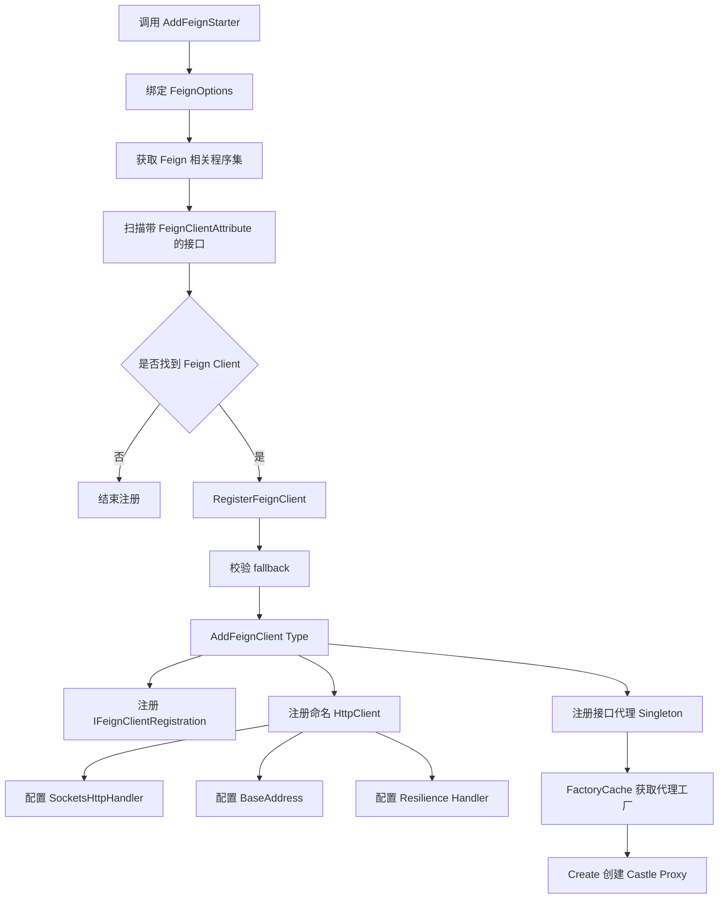
```mermaid
flowchart TD
    A[调用 AddFeignStarter] --> B[绑定 FeignOptions]
    B --> C[获取 Feign 相关程序集]
    C --> D[扫描带 FeignClientAttribute 的接口]
    D --> E{是否找到 Feign Client}
    E -- 否 --> Z[结束注册]
    E -- 是 --> F[RegisterFeignClient]
    F --> G[校验 fallback]
    G --> H[AddFeignClient Type]
    H --> I[注册 IFeignClientRegistration]
    H --> J[注册命名 HttpClient]
    J --> K[配置 SocketsHttpHandler]
    J --> L[配置 BaseAddress]
    J --> M[配置 Resilience Handler]
    H --> N[注册接口代理 Singleton]
    N --> O[FactoryCache 获取代理工厂]
    O --> P[Create<T> 创建 Castle Proxy]
```

### 4.1 项目启动执行流程

业务应用通常在启动阶段通过 `IServiceCollection` 接入 OpenFeign：

```csharp
builder.Services.AddFeignStarter(builder.Configuration, options =>
{
    options.SerializerType = typeof(SystemTextJsonFeignSerializer);
});
```

启动执行链路分为两个阶段：

1. **服务注册阶段**：绑定配置、扫描 Feign Client、注册 `HttpClient`、注册代理工厂和框架组件。
2. **Host 启动阶段**：`FeignClientWarmupHostedService` 预热 `HttpClient`、缓存 client、尝试探测远程服务，并提前实例化 Feign 代理。

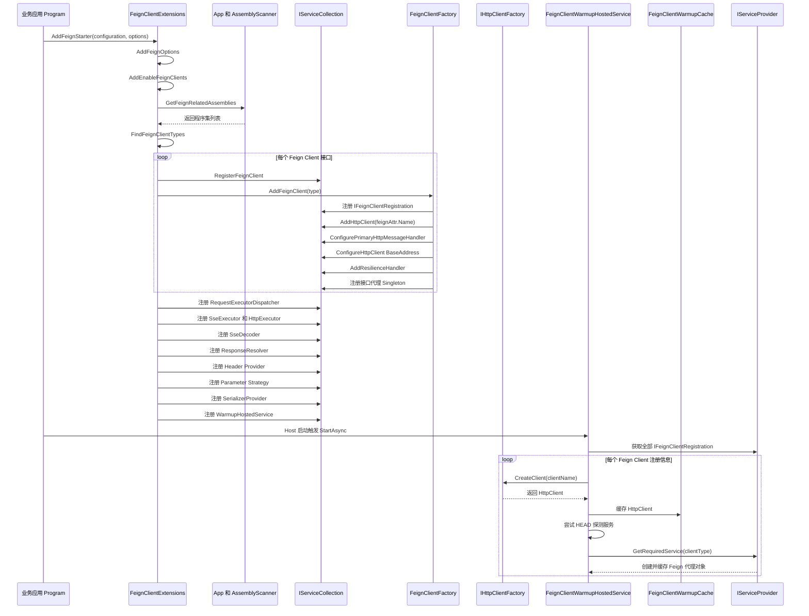
```mermaid
sequenceDiagram
    participant App as 业务应用 Program
    participant Ext as FeignClientExtensions
    participant Scanner as App 和 AssemblyScanner
    participant Services as IServiceCollection
    participant Factory as FeignClientFactory
    participant HttpFactory as IHttpClientFactory
    participant Warmup as FeignClientWarmupHostedService
    participant Cache as FeignClientWarmupCache
    participant Provider as IServiceProvider

    App->>Ext: AddFeignStarter(configuration, options)
    Ext->>Ext: AddFeignOptions
    Ext->>Ext: AddEnableFeignClients
    Ext->>Scanner: GetFeignRelatedAssemblies
    Scanner-->>Ext: 返回程序集列表
    Ext->>Ext: FindFeignClientTypes

    loop 每个 Feign Client 接口
        Ext->>Services: RegisterFeignClient
        Ext->>Factory: AddFeignClient(type)
        Factory->>Services: 注册 IFeignClientRegistration
        Factory->>Services: AddHttpClient(feignAttr.Name)
        Factory->>Services: ConfigurePrimaryHttpMessageHandler
        Factory->>Services: ConfigureHttpClient BaseAddress
        Factory->>Services: AddResilienceHandler
        Factory->>Services: 注册接口代理 Singleton
    end

    Ext->>Services: 注册 RequestExecutorDispatcher
    Ext->>Services: 注册 SseExecutor 和 HttpExecutor
    Ext->>Services: 注册 SseDecoder
    Ext->>Services: 注册 ResponseResolver
    Ext->>Services: 注册 Header Provider
    Ext->>Services: 注册 Parameter Strategy
    Ext->>Services: 注册 SerializerProvider
    Ext->>Services: 注册 WarmupHostedService

    App->>Warmup: Host 启动触发 StartAsync
    Warmup->>Provider: 获取全部 IFeignClientRegistration

    loop 每个 Feign Client 注册信息
        Warmup->>HttpFactory: CreateClient(clientName)
        HttpFactory-->>Warmup: 返回 HttpClient
        Warmup->>Cache: 缓存 HttpClient
        Warmup->>Warmup: 尝试 HEAD 探测服务
        Warmup->>Provider: GetRequiredService(clientType)
        Provider-->>Warmup: 创建并缓存 Feign 代理对象
    end
```

项目启动时的组件关系如下：

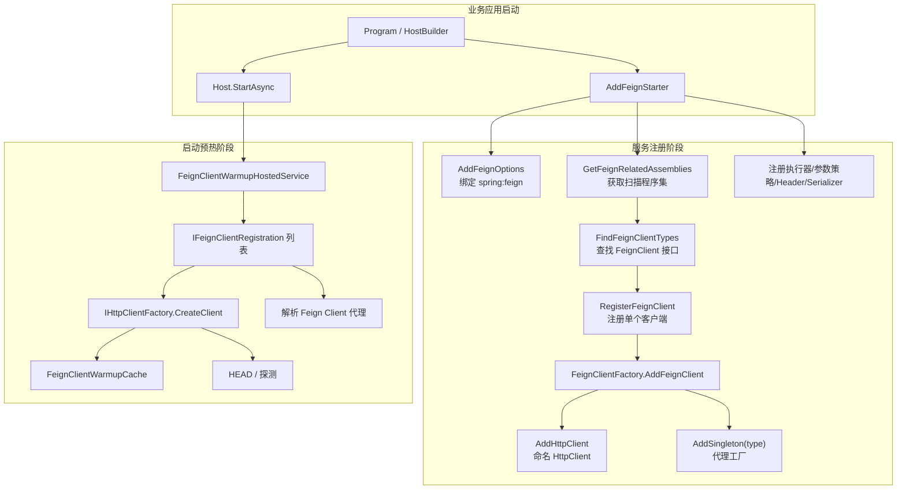
```mermaid
flowchart TB
    subgraph Startup["业务应用启动"]
        Program["Program / HostBuilder"]
        AddStarter["AddFeignStarter"]
        HostStart["Host.StartAsync"]
    end

    subgraph Register["服务注册阶段"]
        Options["AddFeignOptions<br/>绑定 spring:feign"]
        Assemblies["GetFeignRelatedAssemblies<br/>获取扫描程序集"]
        FindClients["FindFeignClientTypes<br/>查找 FeignClient 接口"]
        RegisterClient["RegisterFeignClient<br/>注册单个客户端"]
        AddClient["FeignClientFactory.AddFeignClient"]
        AddHttpClient["AddHttpClient<br/>命名 HttpClient"]
        AddProxy["AddSingleton(type)<br/>代理工厂"]
        AddCore["注册执行器/参数策略/Header/Serializer"]
    end

    subgraph WarmupFlow["启动预热阶段"]
        HostedService["FeignClientWarmupHostedService"]
        Registrations["IFeignClientRegistration 列表"]
        CreateClient["IHttpClientFactory.CreateClient"]
        CacheClient["FeignClientWarmupCache"]
        Probe["HEAD / 探测"]
        ResolveProxy["解析 Feign Client 代理"]
    end

    Program --> AddStarter
    AddStarter --> Options
    AddStarter --> Assemblies
    Assemblies --> FindClients
    FindClients --> RegisterClient
    RegisterClient --> AddClient
    AddClient --> AddHttpClient
    AddClient --> AddProxy
    AddStarter --> AddCore

    Program --> HostStart
    HostStart --> HostedService
    HostedService --> Registrations
    Registrations --> CreateClient
    CreateClient --> CacheClient
    CreateClient --> Probe
    Registrations --> ResolveProxy
```


## 5. Feign Client 代理创建流程

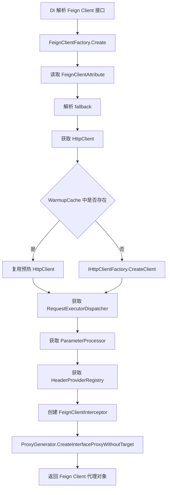
```mermaid
flowchart TD
    A[DI 解析 Feign Client 接口] --> B[FeignClientFactory.Create<T>]
    B --> C[读取 FeignClientAttribute]
    C --> D[解析 fallback]
    D --> E[获取 HttpClient]
    E --> F{WarmupCache 中是否存在}
    F -- 是 --> G[复用预热 HttpClient]
    F -- 否 --> H[IHttpClientFactory.CreateClient]
    G --> I[获取 RequestExecutorDispatcher]
    H --> I
    I --> J[获取 ParameterProcessor]
    J --> K[获取 HeaderProviderRegistry]
    K --> L[创建 FeignClientInterceptor<T>]
    L --> M[ProxyGenerator.CreateInterfaceProxyWithoutTarget<T>]
    M --> N[返回 Feign Client 代理对象]
```

## 6. 一次普通 HTTP 调用流程

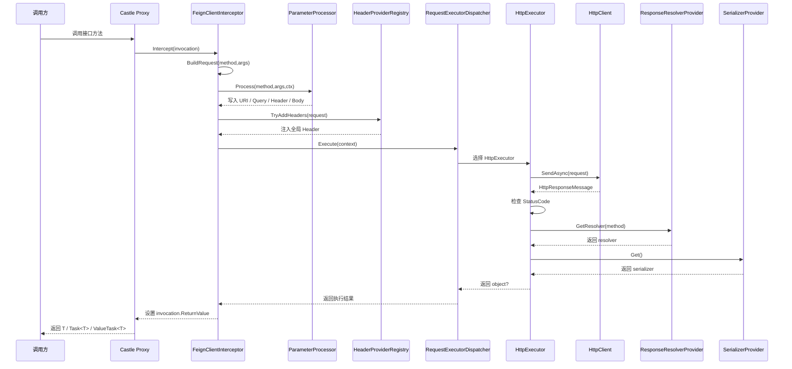
```mermaid
sequenceDiagram
    participant User as 调用方
    participant Proxy as Castle Proxy
    participant Interceptor as FeignClientInterceptor
    participant Param as ParameterProcessor
    participant Header as HeaderProviderRegistry
    participant Dispatcher as RequestExecutorDispatcher
    participant HttpExec as HttpExecutor
    participant HttpClient as HttpClient
    participant Resolver as ResponseResolverProvider
    participant Serializer as SerializerProvider

    User->>Proxy: 调用接口方法
    Proxy->>Interceptor: Intercept(invocation)
    Interceptor->>Interceptor: BuildRequest(method,args)
    Interceptor->>Param: Process(method,args,ctx)
    Param-->>Interceptor: 写入 URI / Query / Header / Body
    Interceptor->>Header: TryAddHeaders(request)
    Header-->>Interceptor: 注入全局 Header
    Interceptor->>Dispatcher: Execute(context)
    Dispatcher->>HttpExec: 选择 HttpExecutor
    HttpExec->>HttpClient: SendAsync(request)
    HttpClient-->>HttpExec: HttpResponseMessage
    HttpExec->>HttpExec: 检查 StatusCode
    HttpExec->>Resolver: GetResolver(method)
    Resolver-->>HttpExec: 返回 resolver
    HttpExec->>Serializer: Get()
    Serializer-->>HttpExec: 返回 serializer
    HttpExec-->>Dispatcher: 返回 object?
    Dispatcher-->>Interceptor: 返回执行结果
    Interceptor-->>Proxy: 设置 invocation.ReturnValue
    Proxy-->>User: 返回 T / Task<T> / ValueTask<T>
```

## 7. 请求构建流程

`FeignClientInterceptor.BuildRequest` 是请求构建的核心入口。

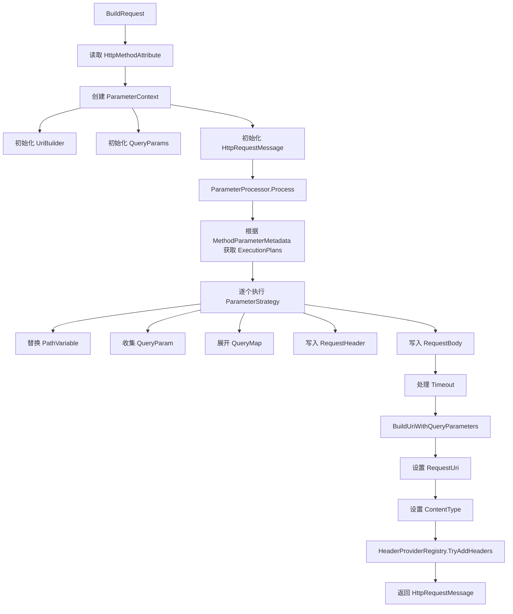
```mermaid
flowchart TD
    A[BuildRequest] --> B[读取 HttpMethodAttribute]
    B --> C[创建 ParameterContext]
    C --> D[初始化 UriBuilder]
    C --> E[初始化 QueryParams]
    C --> F[初始化 HttpRequestMessage]
    F --> G[ParameterProcessor.Process]
    G --> H[根据 MethodParameterMetadata 获取 ExecutionPlans]
    H --> I[逐个执行 ParameterStrategy]
    I --> J[替换 PathVariable]
    I --> K[收集 QueryParam]
    I --> L[展开 QueryMap]
    I --> M[写入 RequestHeader]
    I --> N[写入 RequestBody]
    N --> O[处理 Timeout]
    O --> P[BuildUriWithQueryParameters]
    P --> Q[设置 RequestUri]
    Q --> R[设置 ContentType]
    R --> S[HeaderProviderRegistry.TryAddHeaders]
    S --> T[返回 HttpRequestMessage]
```

## 8. 参数处理架构

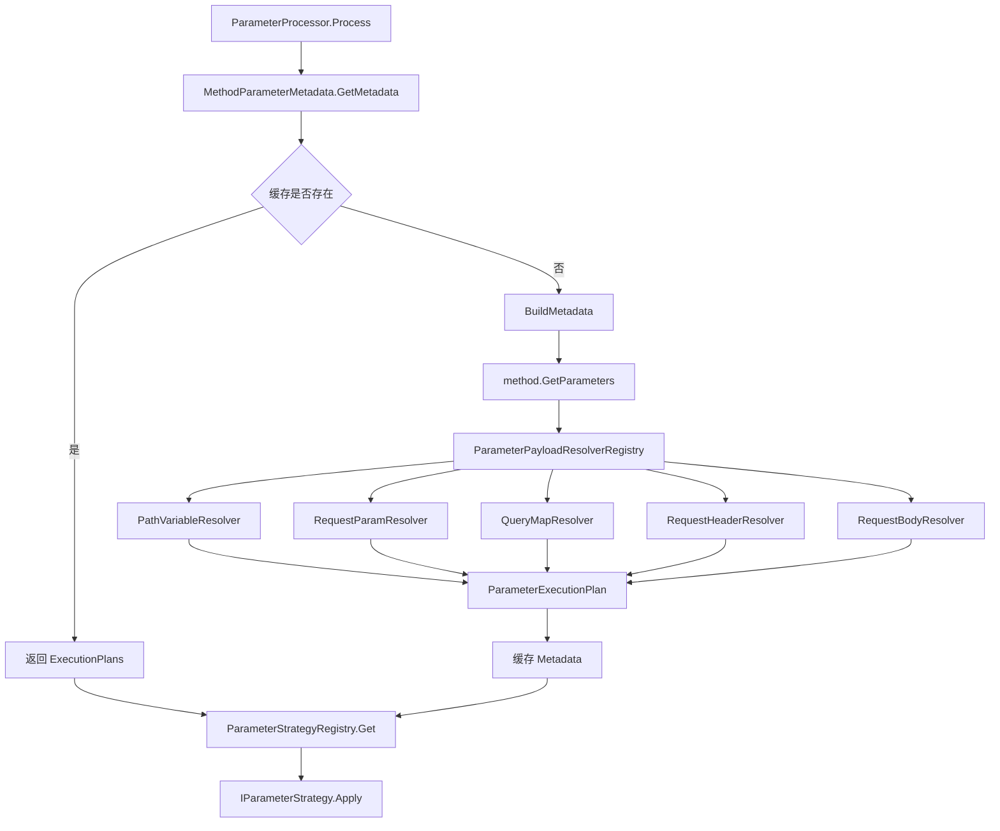
```mermaid
flowchart TB
    A[ParameterProcessor.Process] --> B[MethodParameterMetadata.GetMetadata]
    B --> C{缓存是否存在}
    C -- 是 --> D[返回 ExecutionPlans]
    C -- 否 --> E[BuildMetadata]
    E --> F[method.GetParameters]
    F --> G[ParameterPayloadResolverRegistry]
    G --> H[PathVariableResolver]
    G --> I[RequestParamResolver]
    G --> J[QueryMapResolver]
    G --> K[RequestHeaderResolver]
    G --> L[RequestBodyResolver]
    H --> M[ParameterExecutionPlan]
    I --> M
    J --> M
    K --> M
    L --> M
    M --> N[缓存 Metadata]
    D --> O[ParameterStrategyRegistry.Get]
    N --> O
    O --> P[IParameterStrategy.Apply]
```

## 9. 参数策略职责图

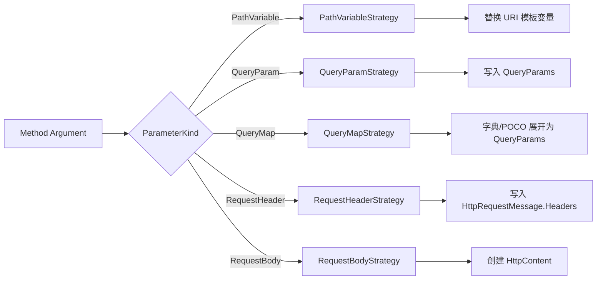
```mermaid
flowchart LR
    A[Method Argument] --> B{ParameterKind}
    B -- PathVariable --> C[PathVariableStrategy]
    B -- QueryParam --> D[QueryParamStrategy]
    B -- QueryMap --> E[QueryMapStrategy]
    B -- RequestHeader --> F[RequestHeaderStrategy]
    B -- RequestBody --> G[RequestBodyStrategy]

    C --> C1[替换 URI 模板变量]
    D --> D1[写入 QueryParams]
    E --> E1[字典/POCO 展开为 QueryParams]
    F --> F1[写入 HttpRequestMessage.Headers]
    G --> G1[创建 HttpContent]
```

## 10. 执行器选择流程

`RequestExecutorDispatcher` 负责选择真正执行请求的执行器。

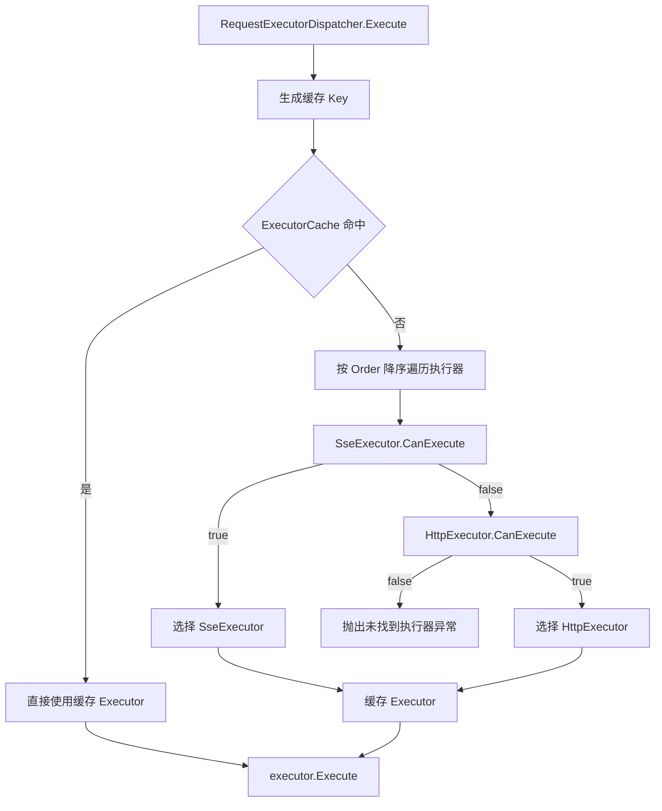
```mermaid
flowchart TD
    A["RequestExecutorDispatcher.Execute"] --> B["生成缓存 Key"]
    B --> C{"ExecutorCache 命中"}
    C -- "是" --> D["直接使用缓存 Executor"]
    C -- "否" --> E["按 Order 降序遍历执行器"]
    E --> F["SseExecutor.CanExecute"]
    F -- "true" --> G["选择 SseExecutor"]
    F -- "false" --> H["HttpExecutor.CanExecute"]
    H -- "true" --> I["选择 HttpExecutor"]
    H -- "false" --> J["抛出未找到执行器异常"]
    G --> K["缓存 Executor"]
    I --> K
    D --> L["executor.Execute"]
    K --> L
```

## 11. HTTP 执行流程

`HttpExecutor` 处理普通 HTTP 请求。响应成功后会先根据接口真实返回类型分流：

- `Stream`：直接读取响应内容流，并返回 `HttpResponseMessageStream` 包装对象。调用方释放返回流时，会同步释放底层 `HttpResponseMessage`，避免连接资源泄漏。
- `byte[]`：直接读取二进制内容，读取完成后立即释放 `HttpResponseMessage`。
- 其他类型：读取响应字符串，再根据 `RawFormat` 决定直接反序列化，或交给 `IFeignResponseResolver` 解析业务响应结构。

文件下载响应不会读取响应体用于 Debug 日志，避免日志记录提前消费流，或把二进制内容加载到内存。

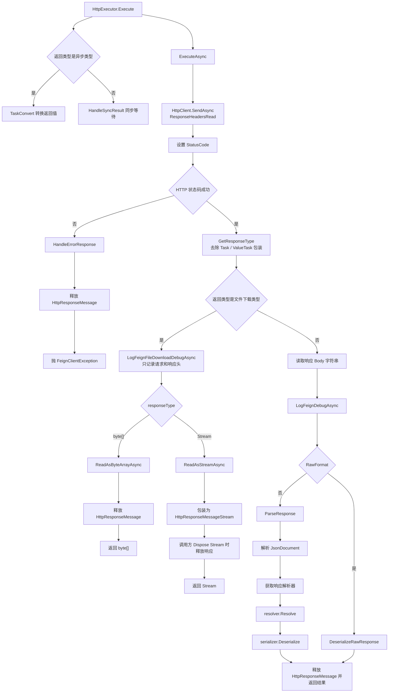
```mermaid
flowchart TD
    A["HttpExecutor.Execute"] --> B["ExecuteAsync"]
    A --> C{"返回类型是异步类型"}
    C -- "是" --> D["TaskConvert 转换返回值"]
    C -- "否" --> E["HandleSyncResult 同步等待"]

    B --> F["HttpClient.SendAsync<br/>ResponseHeadersRead"]
    F --> G["设置 StatusCode"]
    G --> H{"HTTP 状态码成功"}
    H -- "否" --> I["HandleErrorResponse"]
    I --> J["释放 HttpResponseMessage"]
    J --> K["抛 FeignClientException"]

    H -- "是" --> L["GetResponseType<br/>去除 Task / ValueTask 包装"]
    L --> M{"返回类型是文件下载类型"}

    M -- "是" --> N["LogFeignFileDownloadDebugAsync<br/>只记录请求和响应头"]
    N --> O{"responseType"}
    O -- "byte[]" --> P["ReadAsByteArrayAsync"]
    P --> Q["释放 HttpResponseMessage"]
    Q --> R["返回 byte[]"]
    O -- "Stream" --> S["ReadAsStreamAsync"]
    S --> T["包装为 HttpResponseMessageStream"]
    T --> U["调用方 Dispose Stream 时释放响应"]
    U --> V["返回 Stream"]

    M -- "否" --> W["读取响应 Body 字符串"]
    W --> X["LogFeignDebugAsync"]
    X --> Y{"RawFormat"}
    Y -- "是" --> Z["DeserializeRawResponse"]
    Y -- "否" --> AA["ParseResponse"]
    AA --> AB["解析 JsonDocument"]
    AB --> AC["获取响应解析器"]
    AC --> AD["resolver.Resolve"]
    AD --> AE["serializer.Deserialize"]
    AE --> AF["释放 HttpResponseMessage 并返回结果"]
    Z --> AF
```

### 11.1 文件下载响应流程

Feign 接口方法可以直接声明文件下载返回类型：

```csharp
[Get("/api/test/files/abc.doc")]
Task<Stream> DownloadAsync();

[Get("/api/test/files/abc.doc")]
Stream Download();

[Get("/api/test/files/abc.doc")]
Task<byte[]> DownloadBytesAsync();
```

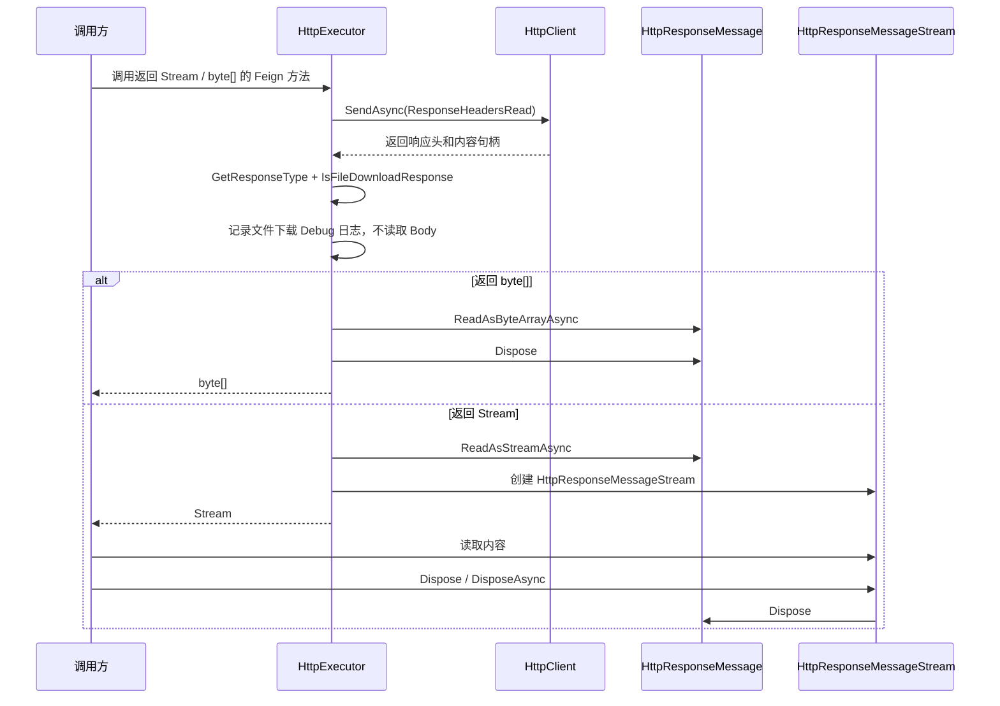
```mermaid
sequenceDiagram
    participant User as 调用方
    participant HttpExec as HttpExecutor
    participant Client as HttpClient
    participant Response as HttpResponseMessage
    participant Wrapper as HttpResponseMessageStream

    User->>HttpExec: 调用返回 Stream / byte[] 的 Feign 方法
    HttpExec->>Client: SendAsync(ResponseHeadersRead)
    Client-->>HttpExec: 返回响应头和内容句柄
    HttpExec->>HttpExec: GetResponseType + IsFileDownloadResponse
    HttpExec->>HttpExec: 记录文件下载 Debug 日志，不读取 Body

    alt 返回 byte[]
        HttpExec->>Response: ReadAsByteArrayAsync
        HttpExec->>Response: Dispose
        HttpExec-->>User: byte[]
    else 返回 Stream
        HttpExec->>Response: ReadAsStreamAsync
        HttpExec->>Wrapper: 创建 HttpResponseMessageStream
        HttpExec-->>User: Stream
        User->>Wrapper: 读取内容
        User->>Wrapper: Dispose / DisposeAsync
        Wrapper->>Response: Dispose
    end
```

`Stream` 场景下不能在 `HttpExecutor` 内提前 `using` 响应对象，否则返回给调用方的内容流会被提前关闭。因此 `HttpResponseMessageStream` 负责把响应对象的生命周期延后到调用方释放流时结束。

## 12. 响应解析器选择流程

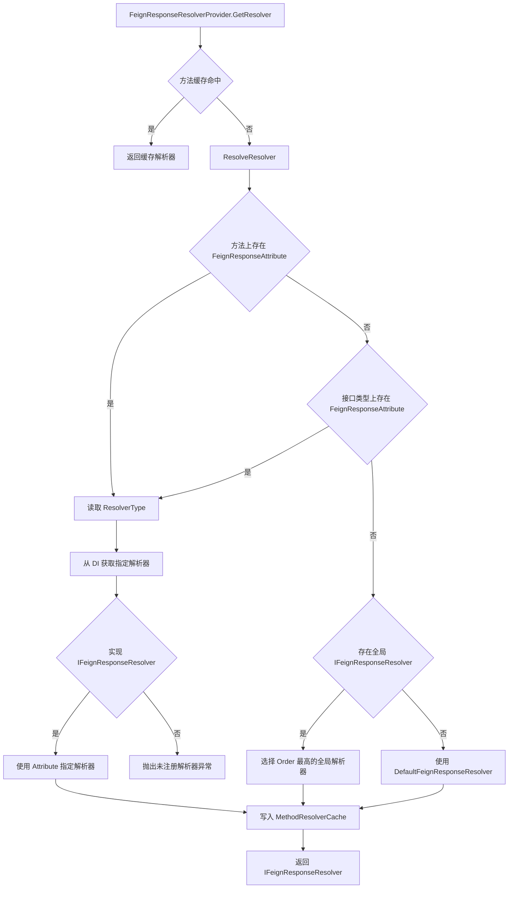
```mermaid
flowchart TD
    A["FeignResponseResolverProvider.GetResolver"] --> B{"方法缓存命中"}
    B -- "是" --> C["返回缓存解析器"]
    B -- "否" --> D["ResolveResolver"]

    D --> E{"方法上存在 FeignResponseAttribute"}
    E -- "是" --> F["读取 ResolverType"]
    E -- "否" --> G{"接口类型上存在 FeignResponseAttribute"}

    G -- "是" --> F
    G -- "否" --> H{"存在全局 IFeignResponseResolver"}

    F --> I["从 DI 获取指定解析器"]
    I --> J{"实现 IFeignResponseResolver"}
    J -- "是" --> K["使用 Attribute 指定解析器"]
    J -- "否" --> L["抛出未注册解析器异常"]

    H -- "是" --> M["选择 Order 最高的全局解析器"]
    H -- "否" --> N["使用 DefaultFeignResponseResolver"]

    K --> O["写入 MethodResolverCache"]
    M --> O
    N --> O
    O --> P["返回 IFeignResponseResolver"]
```

## 13. 默认响应解析流程

默认响应解析器适配常见结构：

```json
{
  "code": 0,
  "data": {},
  "msg": "success"
}
```

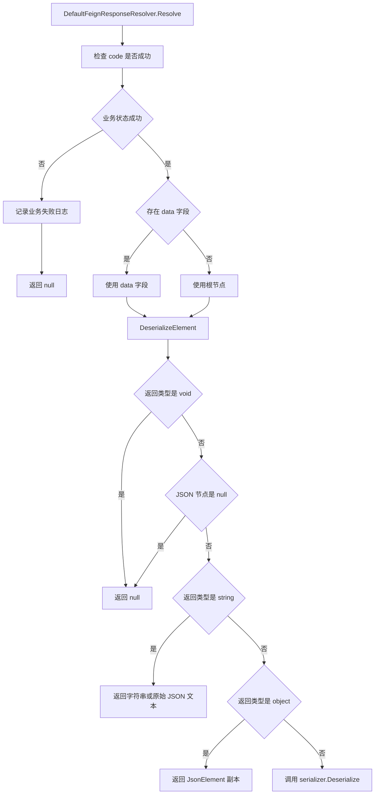
```mermaid
flowchart TD
    A["DefaultFeignResponseResolver.Resolve"] --> B["检查 code 是否成功"]
    B --> C{"业务状态成功"}
    C -- "否" --> D["记录业务失败日志"]
    D --> E["返回 null"]
    C -- "是" --> F{"存在 data 字段"}
    F -- "是" --> G["使用 data 字段"]
    F -- "否" --> H["使用根节点"]
    G --> I["DeserializeElement"]
    H --> I
    I --> J{"返回类型是 void"}
    J -- "是" --> K["返回 null"]
    J -- "否" --> L{"JSON 节点是 null"}
    L -- "是" --> K
    L -- "否" --> M{"返回类型是 string"}
    M -- "是" --> N["返回字符串或原始 JSON 文本"]
    M -- "否" --> O{"返回类型是 object"}
    O -- "是" --> P["返回 JsonElement 副本"]
    O -- "否" --> Q["调用 serializer.Deserialize"]
```

## 14. 序列化器选择流程

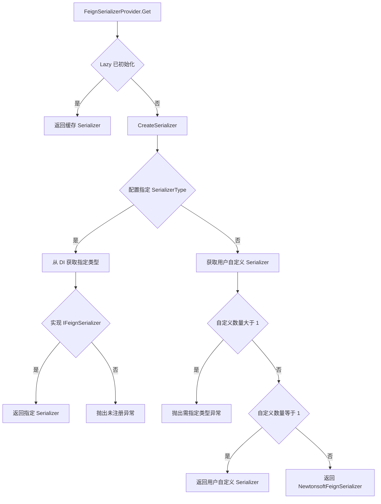
```mermaid
flowchart TD
    A["FeignSerializerProvider.Get"] --> B{"Lazy 已初始化"}
    B -- "是" --> C["返回缓存 Serializer"]
    B -- "否" --> D["CreateSerializer"]
    D --> E{"配置指定 SerializerType"}
    E -- "是" --> F["从 DI 获取指定类型"]
    F --> G{"实现 IFeignSerializer"}
    G -- "是" --> H["返回指定 Serializer"]
    G -- "否" --> I["抛出未注册异常"]
    E -- "否" --> J["获取用户自定义 Serializer"]
    J --> K{"自定义数量大于 1"}
    K -- "是" --> L["抛出需指定类型异常"]
    K -- "否" --> M{"自定义数量等于 1"}
    M -- "是" --> N["返回用户自定义 Serializer"]
    M -- "否" --> O["返回 NewtonsoftFeignSerializer"]
```

## 15. SSE 执行流程

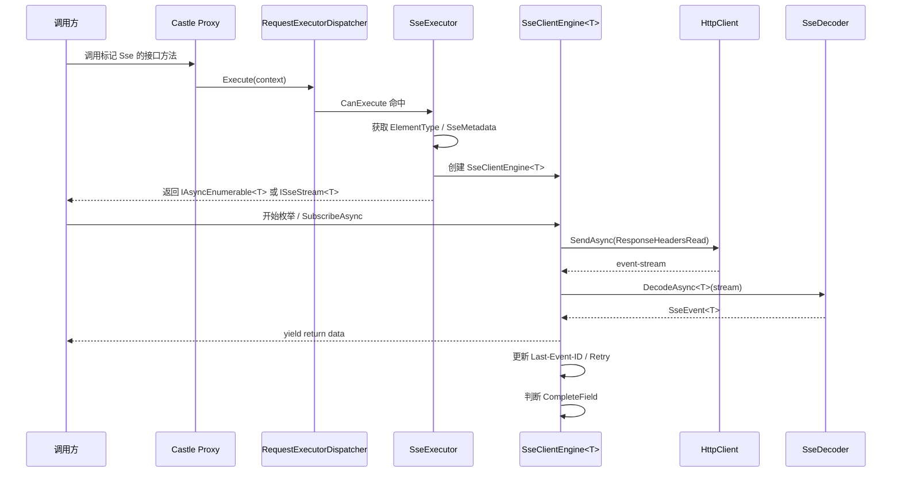
```mermaid
sequenceDiagram
    participant User as 调用方
    participant Proxy as Castle Proxy
    participant Dispatcher as RequestExecutorDispatcher
    participant SseExec as SseExecutor
    participant Engine as SseClientEngine<T>
    participant Client as HttpClient
    participant Decoder as SseDecoder

    User->>Proxy: 调用标记 Sse 的接口方法
    Proxy->>Dispatcher: Execute(context)
    Dispatcher->>SseExec: CanExecute 命中
    SseExec->>SseExec: 获取 ElementType / SseMetadata
    SseExec->>Engine: 创建 SseClientEngine<T>
    SseExec-->>User: 返回 IAsyncEnumerable<T> 或 ISseStream<T>
    User->>Engine: 开始枚举 / SubscribeAsync
    Engine->>Client: SendAsync(ResponseHeadersRead)
    Client-->>Engine: event-stream
    Engine->>Decoder: DecodeAsync<T>(stream)
    Decoder-->>Engine: SseEvent<T>
    Engine-->>User: yield return data
    Engine->>Engine: 更新 Last-Event-ID / Retry
    Engine->>Engine: 判断 CompleteField
```

## 16. SSE 重连流程

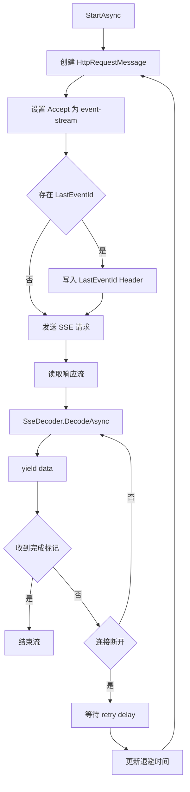
```mermaid
flowchart TD
    A["StartAsync"] --> B["创建 HttpRequestMessage"]
    B --> C["设置 Accept 为 event-stream"]
    C --> D{"存在 LastEventId"}
    D -- "是" --> E["写入 LastEventId Header"]
    D -- "否" --> F["发送 SSE 请求"]
    E --> F
    F --> G["读取响应流"]
    G --> H["SseDecoder.DecodeAsync"]
    H --> I["yield data"]
    I --> J{"收到完成标记"}
    J -- "是" --> K["结束流"]
    J -- "否" --> L{"连接断开"}
    L -- "否" --> H
    L -- "是" --> M["等待 retry delay"]
    M --> N["更新退避时间"]
    N --> B
```

## 17. Header Provider 流程

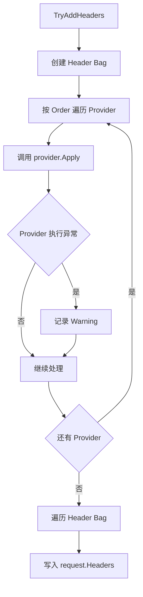
```mermaid
flowchart TD
    A["TryAddHeaders"] --> B["创建 Header Bag"]
    B --> C["按 Order 遍历 Provider"]
    C --> D["调用 provider.Apply"]
    D --> E{"Provider 执行异常"}
    E -- "是" --> F["记录 Warning"]
    E -- "否" --> G["继续处理"]
    F --> G
    G --> H{"还有 Provider"}
    H -- "是" --> C
    H -- "否" --> I["遍历 Header Bag"]
    I --> J["写入 request.Headers"]
```

## 18. Resilience 策略流程

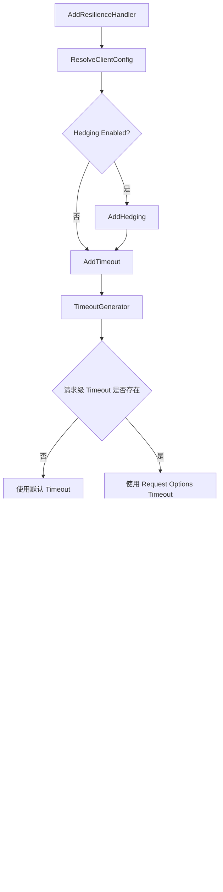
```mermaid
flowchart TD
    A[AddResilienceHandler] --> B[ResolveClientConfig]
    B --> C{Hedging Enabled?}
    C -- 是 --> D[AddHedging]
    C -- 否 --> E[AddTimeout]
    D --> E
    E --> F[TimeoutGenerator]
    F --> G{请求级 Timeout 是否存在}
    G -- 是 --> H[使用 Request Options Timeout]
    G -- 否 --> I[使用默认 Timeout]
    I --> J{Retry Enabled?}
    H --> J
    J -- 是 --> K[AddRetry]
    J -- 否 --> L{CircuitBreaker Enabled?}
    K --> L
    L -- 是 --> M[AddCircuitBreaker]
    L -- 否 --> N[完成 Pipeline]
    M --> N
```

## 19. Warmup 流程

```mermaid
flowchart TD
    A[应用启动] --> B[FeignClientWarmupHostedService.StartAsync]
    B --> C[读取所有 IFeignClientRegistration]
    C --> D[遍历 Feign Client]
    D --> E[创建/预热 HttpClient]
    E --> F[写入 FeignClientWarmupCache]
    F --> G[尝试 HEAD / 探测服务]
    G --> H[解析 Feign Client 代理]
    H --> I{是否还有 Client}
    I -- 是 --> D
    I -- 否 --> J[Warmup 完成]
```

## 20. 缓存设计图

```mermaid
flowchart LR
    A[MethodInfo] --> B[GlobalMethodAttributeCache]
    A --> C[MethodParameterMetadata.MetadataCache]
    A --> D[FeignResponseResolverProvider.MethodResolverCache]
    A --> E[SseMetadataProvider.Cache]
    A --> F[RequestExecutorDispatcher.ExecutorCache]

    G[Type] --> H[FeignClientFactory.FactoryCache]
    G --> I[ObjectPropertyCache]
    G --> J[FeignTaskHelper.ConvertCache]
    G --> K[FeignTaskHelper.TaskTypeCache]
    G --> L[HttpExecutor.FileDownloadResponseTypeCache]

    M[Serializer] --> N[FeignSerializerProvider Lazy]
```

## 21. 异常与 fallback 流程

```mermaid
flowchart TD
    A[FeignClientInterceptor.Intercept] --> B[try 执行请求]
    B --> C{是否抛异常}
    C -- 否 --> D[设置 invocation.ReturnValue]
    C -- 是 --> E[记录 Fallback triggered 日志]
    E --> F{fallback 是否存在}
    F -- 否 --> G[记录 No fallback found]
    G --> H[返回 null]
    F -- 是 --> I[method.Invoke fallback]
    I --> J{fallback 是否成功}
    J -- 是 --> K[返回 fallback 结果]
    J -- 否 --> L[记录 fallback 调用失败]
    L --> H
```

## 22. 扩展点总览

```mermaid
flowchart TB
    A[扩展点] --> B[请求参数扩展]
    A --> C[请求头扩展]
    A --> D[响应解析扩展]
    A --> E[序列化扩展]
    A --> F[执行器扩展]

    B --> B1[IParameterPayloadResolver]
    B --> B2[IParameterStrategy]

    C --> C1[IFeignRequestHeaderProvider]

    D --> D1[IFeignResponseResolver]
    D --> D2[FeignResponseAttribute]

    E --> E1[IFeignSerializer]
    E --> E2[FeignOptions.SerializerType]

    F --> F1[IRequestExecutor]
    F --> F2[IOrdered.Order]
```

## 23. 关键文件索引

| 职责 | 文件 |
|---|---|
| 注册入口 | `FeignClientExtensions.cs` |
| 代理工厂 | `Internal/FeignClientFactory.cs` |
| 拦截器 | `Interceptors/FeignClientInterceptor.cs` |
| 执行上下文 | `Execution/FeignExecutionContext.cs` |
| 请求上下文 | `Execution/FeignRequestContext.cs` |
| 执行器调度 | `Execution/RequestExecutorDispatcher.cs` |
| HTTP 执行器 | `Execution/HttpExecutor.cs` |
| 文件下载响应流包装 | `Execution/HttpResponseMessageStream.cs` |
| SSE 执行器 | `Execution/SseExecutor.cs` |
| 参数处理器 | `Processors/ParameterProcessor.cs` |
| 参数元数据 | `Processors/MetadataInfos/MethodParameterMetadata.cs` |
| 参数策略注册表 | `Processors/Strategies/ParameterStrategyRegistry.cs` |
| 参数辅助工具 | `Processors/ParameterProcessorHelper.cs` |
| Header 注册表 | `Headers/FeignRequestHeaderProviderRegistry.cs` |
| 响应解析器 Provider | `Execution/ResponseResolver/FeignResponseResolverProvider.cs` |
| 默认响应解析器 | `Execution/ResponseResolver/DefaultFeignResponseResolver.cs` |
| 序列化器 Provider | `Serializer/FeignSerializerProvider.cs` |
| System.Text.Json 序列化器 | `Serializer/SystemTextJsonFeignSerializer.cs` |
| Newtonsoft 序列化器 | `Serializer/NewtonsoftFeignSerializer.cs` |
| SSE 引擎 | `Sse/SseClientEngine.cs` |
| SSE 解码器 | `Sse/SseDecoder.cs` |
| SSE 流对象 | `Sse/FeignSseStream.cs` |
| Warmup 服务 | `Hosting/FeignClientWarmupHostedService.cs` |
| Warmup 缓存 | `Internal/FeignClientWarmupCache.cs` |

## 24. 当前架构中的性能关键点

项目已经包含多处缓存设计：

- 执行器选择缓存：`RequestExecutorDispatcher`。
- 方法 HTTP Attribute 缓存：`GlobalMethodAttributeCache`。
- 参数元数据缓存：`MethodParameterMetadata`。
- 响应解析器缓存：`FeignResponseResolverProvider`。
- 序列化器懒加载：`FeignSerializerProvider`。
- 代理工厂缓存：`FeignClientFactory.FactoryCache`。
- Task 转换委托缓存：`FeignTaskHelper`。
- 文件下载返回类型判断缓存：`HttpExecutor.FileDownloadResponseTypeCache`。
- SSE 元数据缓存：`SseMetadataProvider`。
- 对象属性缓存：`ObjectPropertyCache`。

这些缓存的目标是把反射、泛型方法构造、Attribute 查找等成本尽量压缩到首次调用阶段。

## 25. 推荐阅读顺序

如果是第一次阅读项目，建议按下面顺序看：

1. `FeignClientExtensions.cs`
2. `Internal/FeignClientFactory.cs`
3. `Interceptors/FeignClientInterceptor.cs`
4. `Processors/ParameterProcessor.cs`
5. `Execution/RequestExecutorDispatcher.cs`
6. `Execution/HttpExecutor.cs`
7. `Execution/ResponseResolver/DefaultFeignResponseResolver.cs`
8. `Serializer/FeignSerializerProvider.cs`
9. `Execution/SseExecutor.cs`
10. `Sse/SseClientEngine.cs`
